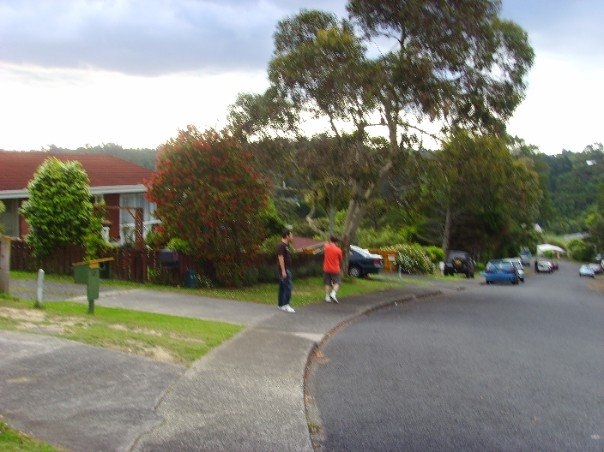

Title:          The art of "Flashpacking"
Authors:        Darren Hoyland
Date:           2007-11-25
Tags:           General Mutterings, Travel Diaries, New Zealand
HeaderImage:    flash.jpg
Category:       Blog
Publish:        False

Maybe its just me, but NZ seems to be full of travellers who left to find themselves then unfortunately found themselves working in Pak 'n Save for $4 an hour. Can't blame 'em, its hard to visit here and not want to stay, it is a beautiful country and although completely different to England, you can't help but think that maybe England used to be similar prior to the industrial revolution: by that I mean prior to people like me visiting, deciding to stay, then proceeding to wreck the place by overpopulating it. Still, I get the impression that the kiwis are going to learn by previous mistakes and maybe look after the place. They do seem to flash their eco-credentials around quite a bit, although we are ignoring the fact that their cars are all 30 year old, mobile smog factories (you don't need tax or an MOT here) and they drive EVERYWHERE, so I'm told: nobody walks.

Maybe it's just the beautiful countryside, but its probably the price tag for the beautiful countryside: you can buy land next to the beach for about £9 grand an acre here... and that's only what we've seen. There are bargains to be had here people, and the strong pound means its shopping time!

Shame about the high chav factor around certain towns though. Taupo would otherwise be virtually perfect. I always thought that they were the product of having to hang around towns with no good clean fun activities to do, but having seen them here, in a whole country of rolling hill, beaches and cheap sports to be doing only goes to show that they're just dicks. Go figure.

Other than the chavs, the kiwis seem to come in two more flavours: Incredibly sarcastic or very, very helpful and nice. The nice ones are by far the more numerous and will seem to go right out of their way to help you out. Marj has had some trouble using her meastro card over here and at the bank two or three of them were practically fighting to look after her - two of them even came out to the cashpoint with her to help her, totally ignoring the other people waiting in the queue in the process, mind you. Bizarre. It's as if they'd ask you on the street if you'd like a polo mint and if you said yes, they'd go find the nearest shop and buy you a packet.

While we're on the subject of stereotypes, I've recently learned that we are what's known as Flashpackers, or "Champagne Backpackers". This is essentially doing the backpacking thing, but with 2 giant suitcases (because hairdryers, hair straighteners, hair unstraighteners and more shoes that the Trafford Centre falls well within the 'travelling light' category according to Marjan*). With these meagre possessions, and with only the aid of a hire car and a inter-island plane service, we're practically slumming it. (Yeah alright, it's cheating but fuck it, I'm on holiday :-) )

On top of all that, rather than camping or staying in dorms with 15 other people as we attempted the first night**, we've been staying in inexpensive motels. Just in case you're ever in NZ, here's a brief review of them so far:

PIC HERE - Fat Camel in Auckland

According top the brouchures and lonely planet, the fat camel is "voted the best hostel in the whole of New Zealand!". It does however neglect to add "by morons" (with possibly a few more "!!!"'s). With place's like this, you'd be forgiven for saying things like "If the walls could talk, they'd have some stories", but in this case the mould is so bad, they probably can! It's full of screaming 18 year olds, which is great if you're a screaming 18 year old, but less so if you've lived in squalour for your first 3 years at university and have now decided to give it up... and maybe have some jabs, just to be on the safe side.

Linda and Pauls's in North Shore, Auckland:

Luxuary!

PIC HERE - Minitel in Rotorua

Tiny, but it did have a spa (as in jacuzzi, not as in shop) which was ace.

PIC HERE - Burke's in Taupo

Very nice - we stayed here 2 nights.

PIC HERE - Juno's in Waitomo

Basic, but secluded and really nice scenery.

PIC HERE - Mousetrap in Paihia

Very nice place, almost.... too nice. This place (from where I'm currently writing) is run by a guy who seems to have a mild case of obsessive compulsive disorder. Everything is intricately labelled and people seem to put things back because they're so creeped out by him. Its a bit like that scene from that 80s film "sleeping with the enemy" where she has to put all the cans in the cupboard facing forward, or maybe like those freaks who always go around the aisles in a supermarket in a specific pattern and get really angry if ASDA moves stuff around.

I'm not sure if he had it before he started doing this or if it drove him to it, but you definately get the impression that he'd love this whole hostelling business if it wasn't for the people. Still, it's a very nice place.

This is our third and final night in both the mousetrap and in the north island (except for one day on the way back when we have to go to the airport) and typically we found the perfect beach up in Matarui Bay (spelling is probably wrong). Oh well, South Island tomorrow and we'll see what gems that turns up...

---

\* - I'm guilty too seeing as though I've brought my laptop.

\** - Okay, so it was 2 other people, but one smelled and looked at us funny.

