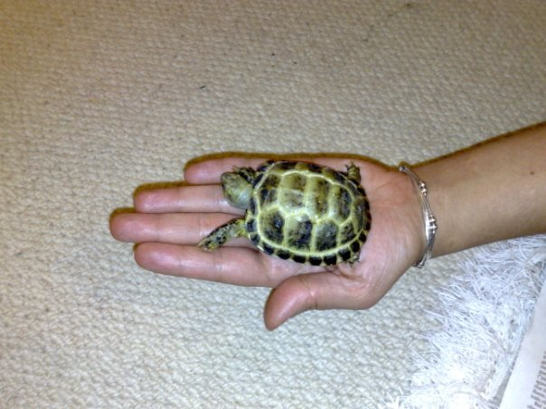

Title:          The tortoise and the... er... internet 
Authors:        Darren Hoyland
Date:           2008-01-28
Tags:           General Mutterings, Xmas, Yoda, Tortoise
HeaderImage:    
Category:       Blog
Publish:        True

It's a little late, but merry secular yuletide/xmas greets and happy new year everybody! I know its the end of January now, but it's all Tiscali's fault.

Pretty much since we got back from New Zealand, we haven't had a working landline until today, and I've been so busy at work that I've actually had to work, as opposed to playing around writing to my blog and such like. This was in part, something to do with not being able to work from home as we had no internet.

Today, we finally got t'internet back, so now seems as good a time as any to mention that I *officially* moved in with Marj. To celebrate, we bought a tortoise. We named it Yoda, presumably because its small and green, rather than because it will live for a long, long time.

